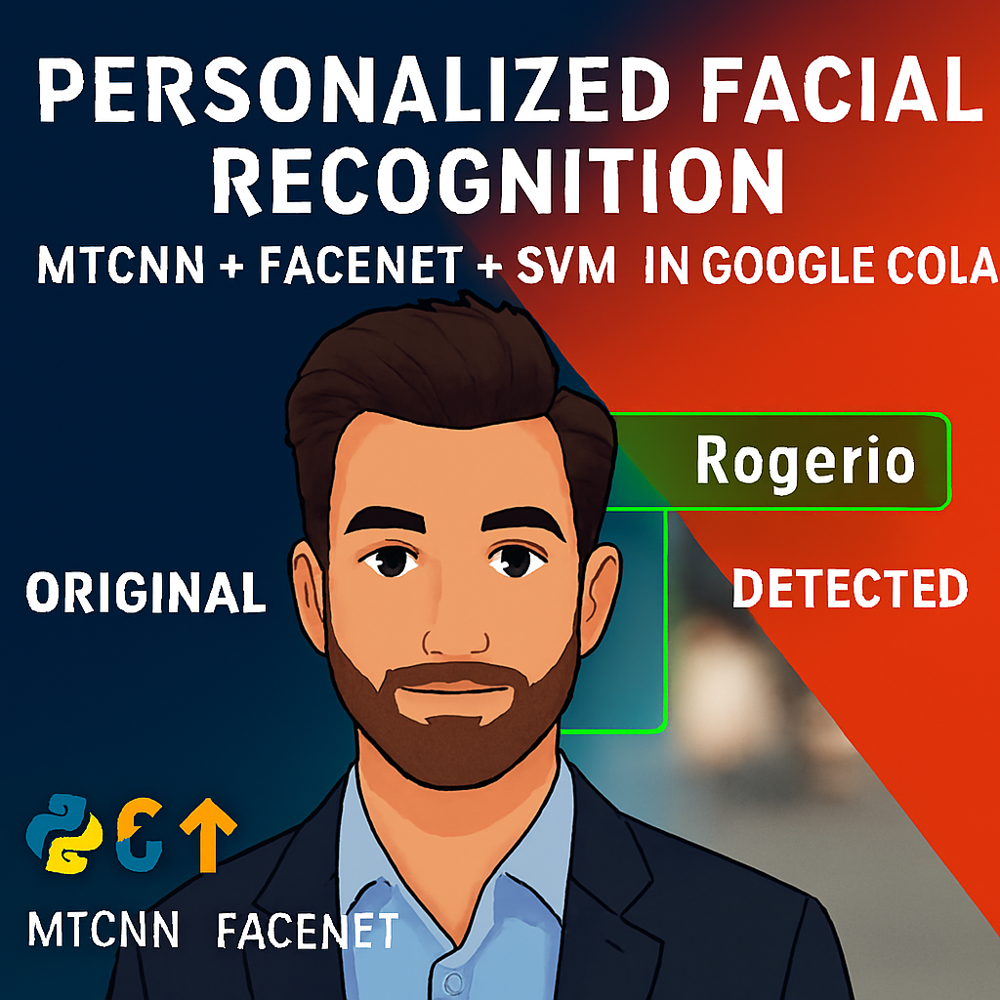

# Facial-Detection-Project

# 🧠 Projeto de Detecção Facial com WEB CAM

## 🚀 Reconhecimento de rostos em imagens via Google Colab

## 📌 Projeto de Detecção Facial
Este projeto foi desenvolvido em Python utilizando Google Colab e Jupyter Notebook.  
 [Abrir no Google Colab](https://colab.research.google.com/github/Rogerio5/Facial-Detection-Project/blob/main/Facial_Detection.ipynb
) 

---

## 🏅 Badges

- 📦 Tamanho do repositório / Repository Size:  
  

- 📄 Licença do projeto / Project License:  
  

---

## 📋 Índice / Table of Contents

- [Descrição / Description](#descrição--description)  
- [Status / Status](#status--status)  
- [Funcionalidades / Features](#funcionalidades--features)  
- [Execução / Execution](#execução--execution)  
- [Tecnologias / Technologies](#tecnologias--technologies)  
- [Desenvolvedor / Developer](#desenvolvedor--developer)  
- [Licença / License](#licença--license)  
- [Conclusão / Conclusion](#conclusão--conclusion)  

---

## 📖 Descrição / Description

**PT:**  
Este projeto demonstra como aplicar técnicas avançadas de visão computacional para realizar reconhecimento facial em imagens e webcam, utilizando o ambiente interativo do Google Colab. A aplicação permite:

📁 Carregar imagens locais ou via upload no Colab

🧠 Detectar rostos com o detector MTCNN

🔍 Extrair características faciais com Keras-FaceNet

🧪 Classificar rostos com SVM ou realizar verificação facial

📸 Capturar imagens diretamente da webcam (opcional)

🖼️ Exibir comparações lado a lado entre imagem original e imagem detectada

💾 Salvar imagens processadas com bounding boxes e nomes identificados

**EN:**  
This project demonstrates how to apply advanced computer vision techniques to perform facial recognition using images and webcam input, all within the interactive environment of Google Colab. The application allows you to:

📁 Upload training and test images directly in Colab

🧠 Detect faces using the MTCNN face detector

🔍 Extract facial features with Keras-FaceNet

🧪 Classify faces using SVM or perform facial verification

📸 Capture images from the webcam (optional)

🖼️ Display side-by-side comparisons of original and detected images

💾 Save processed images with bounding boxes and identified names

---

## 🚧 Status / Status

- ✅ Detecção facial funcional com Haar Cascade  
- ✅ Visualização interativa com Matplotlib  
- ✅ Upload e captura de imagens no Colab  
- ✅ Pronto para expansão com DNN ou MTCNN

---

## ⚙️ Funcionalidades / Features

| 🧩 Funcionalidade (PT)                      | 💡 Description (EN)                          |
|--------------------------------------------|----------------------------------------------|
| 🖼 Upload de imagem no Colab                | 🖼 Upload image via Colab interface           |
| 📷 Captura via webcam (opcional)           | 📷 Webcam capture (optional)                 |
| 🧠 Detecção com Haar Cascade                | 🧠 Face detection using Haar Cascade         |
| 🖼 Comparações lado a lado                  | 🖼 Side-by-side visual comparisons            |
| 💾 Salvamento de imagem detectada          | 💾 Save processed image with bounding boxes  |

---

## 🚀 Execução / Execution

**PT:**  
Para executar o projeto no Colab:

1. Faça upload da imagem ou use a webcam  
2. Carregue o classificador Haar Cascade  
3. Aplique a detecção facial com `cv2.CascadeClassifier`  
4. Exiba os resultados com `matplotlib`  
5. Salve a imagem detectada com `cv2.imwrite`

**EN:**  
To run the project on Colab:

1. Upload an image or use webcam  
2. Load Haar Cascade classifier  
3. Apply face detection using `cv2.CascadeClassifier`  
4. Display results using `matplotlib`  
5. Save detected image using `cv2.imwrite`

---

## 🌐 Acesso / Access

- [Repositório GitHub / GitHub Repository](https://github.com/Rogerio5/Facial-Detection-Project)

---

## 🧰 Tecnologias / Technologies

  
  
  
  
  
  
  
  

 

---

## 👨‍💻 Desenvolvedor / Developer

- [Rogerio](https://github.com/Rogerio5)   

---

## 📜 Licença / License

Este projeto está sob licença MIT. Para mais detalhes, veja o arquivo `LICENSE`.  
This project is under the MIT license. For more details, see the `LICENSE` file.

---

## 🏁 Conclusão / Conclusion

**PT:**  
Este projeto é uma introdução prática ao reconhecimento facial personalizado, combinando MTCNN, Keras-FaceNet, SVM e OpenCV para manipulação e visualização. Ideal para quem deseja explorar visão computacional de forma acessível, sua estrutura modular permite expandir para múltiplas faces, detecção em vídeo e integração com redes neurais.

**EN:**  
This project is a practical introduction to custom facial recognition, combining MTCNN, Keras-FaceNet, SVM, and OpenCV for image manipulation and visualization. It is ideal for those who want to explore computer vision in an accessible way. Its modular structure makes it easy to expand for multiple faces, video detection, and integration with neural networks.
